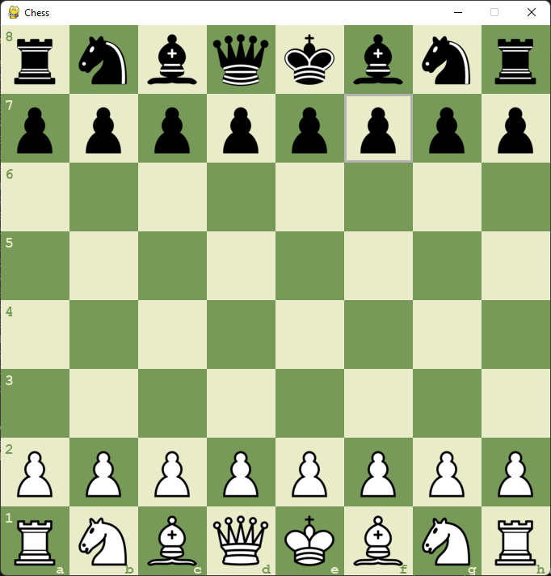
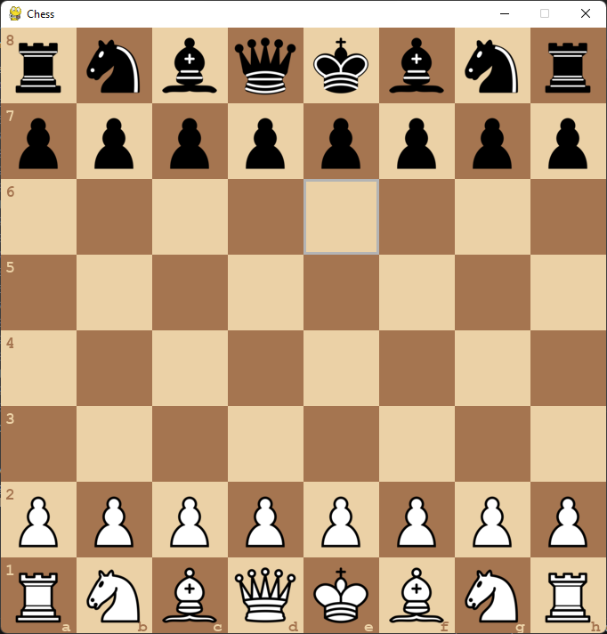
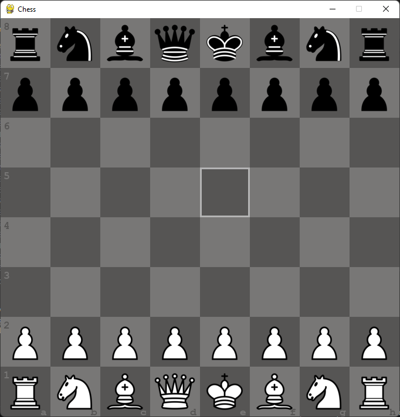
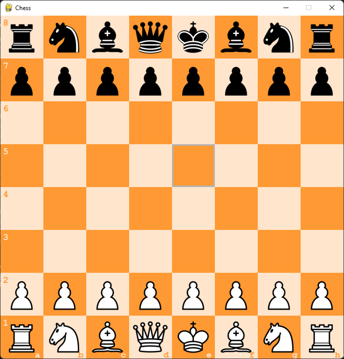
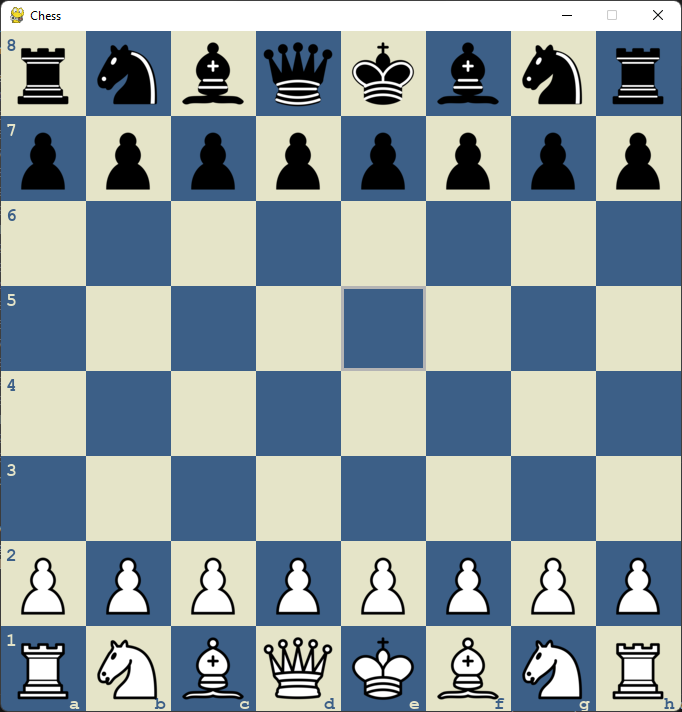
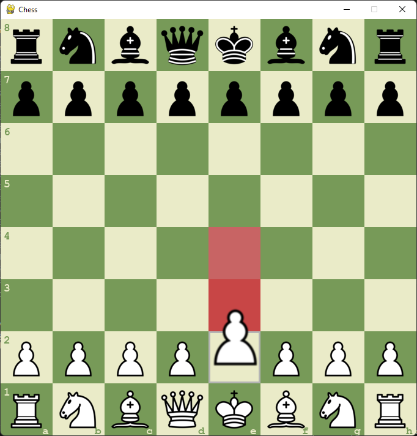
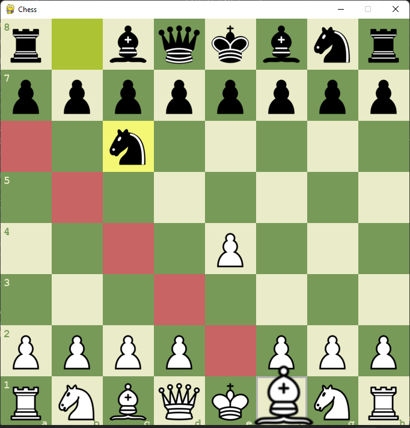
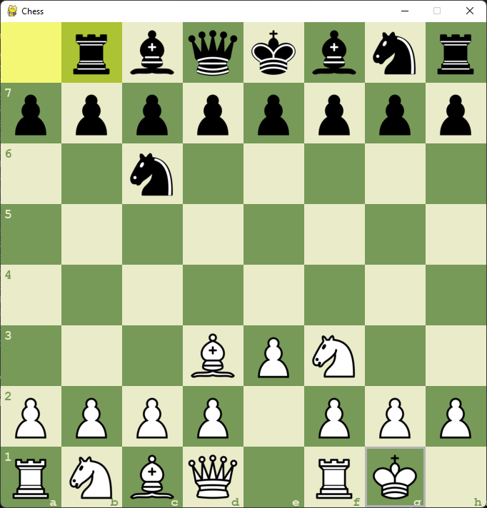

# AI Chess Duel

## Description 
Experience the thrill of chess with AI Chess Duel! This game pairs you against a smart computer opponent that thinks ahead using the minimax algorithm—a clever way to predict your moves. Whether you're new to chess or a seasoned player, this game will make every match both fun and challenging.

## Key Features
- **Smart AI Opponent**: Play against a computer that plans its moves strategically.
- **Easy-to-Use Interface**: Enjoy a clear and simple layout, making it easy to play.
- **Visual Move Highlights**: See the last moves made, helping you follow the game.
- **True to Chess Rules**: All the classic chess moves and rules are here. 

## Prerequisites
- **Python**: Version 3.7 or newer. [Download Python](https://www.python.org/downloads/)
- **Operating System**: Compatible with Windows, macOS, and Linux.
- **Libraries**: Pygame 2.0 (For game development). Install using pip install pygame.
- **Graphics**: Basic graphics card with updated drivers.
- **Memory**: At least 100MB of free RAM.
- **Storage**: 50MB of free disk space.
- **Internet**: Not required.
- **Entry Point**: Run main.py

## Gameplay Walkthrough

### Board theme - green

### Board theme - brown

### Board theme - grey

### Board theme - orange

### Board theme - blue

### Valid moves 1

### Valid moves 2

### Castling
